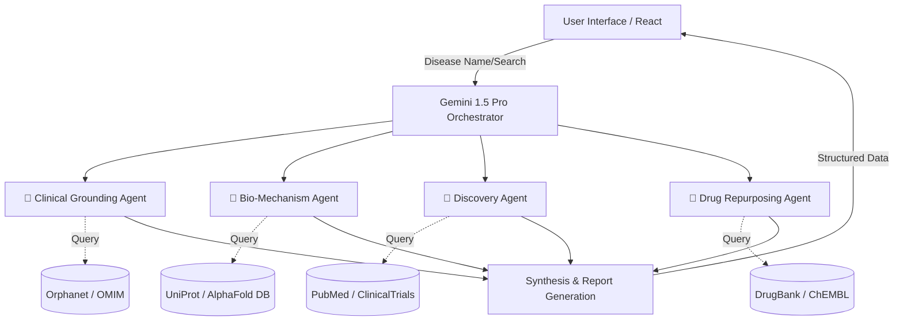
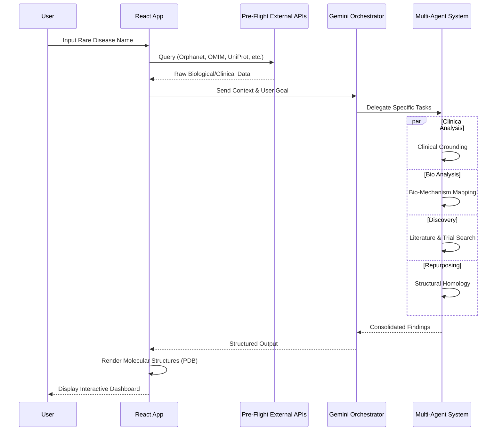

# 🧬 OrphaFold-AI

**Deep Genomic Discovery for Rare Diseases**


[](https://deepmind.google/technologies/gemini/)
[](https://www.typescriptlang.org/)
[](https://react.dev/)
[](https://alphafold.ebi.ac.uk/)
[](https://www.orpha.net/)
[](https://pubmed.ncbi.nlm.nih.gov/)
[](https://www.ncbi.nlm.nih.gov/clinvar/)


# OrphaFold AI : Deep Structural Search for Orphan Diseases

> [!NOTE]
> OrphaFold-Ai is a **Research Prototype and Proof of Concept (PoC)**. It is intended for professional researchers and geneticists as a decision-support tool, not as a clinical system.

OrphaFold is an AI-powered platform designed to accelerate research into orphan diseases by combining real-time API enrichment with advanced Multi-Agent orchestration and structural biology.

## 👁️ The "Why" (Vision)

Today, 300 million people live with a rare disease. Yet, **95% of these 7,000+ conditions have no approved treatment**. This is largely driven by a chronic lack of funding, economic barriers, and fragmented knowledge trapped in silos.

- **Structural Intelligence**: Using protein structures (AlphaFold) as a key baseline for discovery.
- **Binding Pocket Analysis**: Performing comparative analysis of protein binding pockets and 3D folds.
- **Democratizing Repurposing**: Identifying hidden connections between existing drugs and rare proteins through structural homology.

## 📸 Interface Preview

<div align="center">

| 🏠 Search & Home | 🧪 Biological Insights |
|:---:|:---:|
|  |  |
| **💊 Hypothesis Lab** | **🔬 Research Tracking** |
|  |  |
| **👁️ Project Vision** | **🧬 Structural Analysis** |
|  |  |
| **🧪 Cross-Disease Insights** | **� Structural Proteomics (AlphaFold)** |
|  |  |
| **📚 Bibliography Management** | |
|  | |

</div>

## 🧬 The Agent Architecture

OrphaFold-Ai orchestrates a 4-agent pipeline to analyze orphan pathologies from multiple biological perspectives:



### 1. 🏥 Clinical Grounding Agent
*   **Purpose:** Establishes the clinical baseline using direct REST APIs.
*   **APIs & Tools:** Orphanet (orphadata.com), OMIM (NCBI E-utilities), Google Search Grounding.
*   **Output:** Prevalence, inheritance patterns, and disease classifications.

### 2. 🧪 Bio-Mechanism Agent
*   **Purpose:** Uncovers the molecular pathophysiology and structural machinery.
*   **APIs & Tools:** UniProt, NCBI Gene, ClinVar, AlphaFold DB.
*   **Output:** Target proteins, functional domains, pLDDT confidence, and druggability assessments.

### 3. 🔬 Discovery Agent
*   **Purpose:** Connects the disease to the broader research and clinical landscape.
*   **APIs & Tools:** PubMed (NCBI), ClinicalTrials.gov, structural homology search.
*   **Output:** Active trials, synthesized bibliography, and cross-disease insights.

### 4. 💊 Drug Repurposing Agent (The Synthesis Catalyst)
*   **Purpose:** Proposes therapeutic candidates by bridging mechanism overlap via **Structural Homology** (On-Demand).
*   **APIs & Tools:** DrugBank, ChEMBL, Reasoning Engine (thinking budget), 3D Binding Pocket analysis.
*   **Output:** In-silico repurposing hypotheses with feasibility scores based on 3D fold similarity and catalytic site mapping.

---

## 🚀 How it Works (Workflow)

1.  **Input:** The user enters a rare disease name or description (e.g., "Cystic Fibrosis").
2.  **API Enrichment:** The system acts as a "Pre-Flight" layer, simultaneously querying:
    *   *Orphanet, OMIM, UniProt, NCBI Gene, ClinVar, PubMed.*
3.  **Agent Orchestration:** The gathered context is fed into the Multi-Agent System powered by **Gemini 1.5 Pro**.
4.  **Synthesis & Homology:** The agents reason over the data, perform structural homology analysis to identify shared binding motifs, and generate a structured report.
5.  **Visualization:** The frontend renders interactive molecular structures (pdb), clinical data cards, and research timelines directly from the AlphaFold DB.



---

## 💻 Installation

**Prerequisites:** Node.js (v18+)

1.  **Clone the repository:**
    ```bash
    git clone https://github.com/ankush850/Orphafold_AI.git
    cd orphafold
    ```

2.  **Install dependencies:**
    ```bash
    make install
    # OR
    npm install
    ```

3.  **Configure Environment:**
    *   Create a `.env.local` file in the root directory.
    *   Add your Gemini API Key:
        ```env
        GEMINI_API_KEY=your_api_key_here
        ```

4.  **Run Locally:**
    ```bash
    make dev
    # OR
    npm run dev
    ```

## 🌍 Deployment

This project is optimized for deployment on **Google AI Studio**.

---
# OrphaFold AI Project Details

## Inspiration
Today, over 300 million people live with a rare disease. Yet, **95% of these 7,000+ conditions have no approved treatment**. This crisis is largely driven by a chronic lack of funding, economic barriers, and fragmented knowledge trapped in data silos. We were inspired to bridge this gap by leveraging modern AI to democratize drug repurposing and provide actionable, structured insights for researchers and geneticists working tirelessly to find cures.

## What it does
OrphaFold AI is a research platform that accelerates discovery in orphan diseases by combining real-time API enrichment with advanced Multi-Agent orchestration. 
When a researcher inputs a rare disease, the platform acts as a "Pre-Flight" layer to query multiple biological APIs. It then delegates specialized analysis to four intelligent agents:
1. **Clinical Grounding Agent:** Establishes the clinical baseline (prevalence, inheritance).
2. **Bio-Mechanism Agent:** Uncovers molecular pathophysiology and structural machinery.
3. **Discovery Agent:** Connects the disease to active trials and clinical landscape.
4. **Drug Repurposing Agent:** Proposes therapeutic candidates via 3D structural homology and binding pocket analysis.

## How we built it
The platform is powered by a robust stack:
*   **Orchestration Engine:** We utilized **Gemini 1.5 Pro** to manage and orchestrate the complex interactions of our 4-agent system.
*   **Frontend:** Built a responsive, interactive UI using **React** and **TypeScript** to render molecular structures and clinical data cards.
*   **Data Integration:** Integrated a wide array of REST APIs including Orphanet, OMIM, UniProt, AlphaFold DB, PubMed, ClinicalTrials.gov, DrugBank, and ChEMBL.

## Challenges we ran into
*   **Data Silos & API Integration:** Normalizing data across so many different biological databases (from genetic data to protein structures) proved challenging.
*   **Agent Orchestration:** Ensuring that the Gemini agents collaborated effectively without hallucinations, maintaining strict adherence to the biological context.
*   **Structural Analysis in Real-Time:** Incorporating 3D binding pocket analysis and structural homology scoring in a way that feels fluid and responsive on the UI.

## Accomplishments that we're proud of
*   Successfully orchestrating a 4-agent AI pipeline that handles specialized biomedical reasoning flawlessly.
*   Integrating real-time 3D protein visualization (via AlphaFold DB) directly into the decision-support dashboard.
*   Creating a synthesis loop that automatically generates highly plausible drug repurposing hypotheses based on structural overlap, rather than just literature scraping.

## What we learned
*   We gained deep insights into the complexity of orphan diseases and the structural biology behind them.
*   We learned advanced prompt engineering and agent delegation techniques to keep LLMs strictly grounded in external API data.
*   We realized the immense potential for AI to break down barriers in neglected fields of medicine.

## What's next for Orphafold AI
*   **Direct Docking Simulations:** Integrating in-silico simulations directly within the agentic loop to transform our structural hypotheses into predictive, quantitative scores.
*   **Agent Development Kit (ADK):** Transitioning to a more comprehensive orchestration and modularity framework.
*   **Pilot Beta Tests:** Collaborating directly with geneticists and rare disease researchers to validate our platform's utility in real-world scenarios.
*   **Scale Data Sources:** Expanding our data ingestion to include real-world evidence (RWE) and even more specialized genomic repositories.


## 🚀 Next Steps

Our journey from discovery to impact continues with the following roadmap:

- **Direct Docking Simulations**: Integrate in-silico simulations directly within the agentic loop to transform hypotheses into predictive scores.
- **Agent Development Kit (ADK)**: Transition to the ADK framework to leverage more comprehensive orchestration and modularity.
- **Pilot Beta Tests**: Collaborate with geneticists and rare disease researchers to validate the platform's utility in real-world research scenarios.
- **Scale Data Sources**: Expand the agent pipeline to include more specialized biomedical repositories and real-world evidence (RWE) data.
